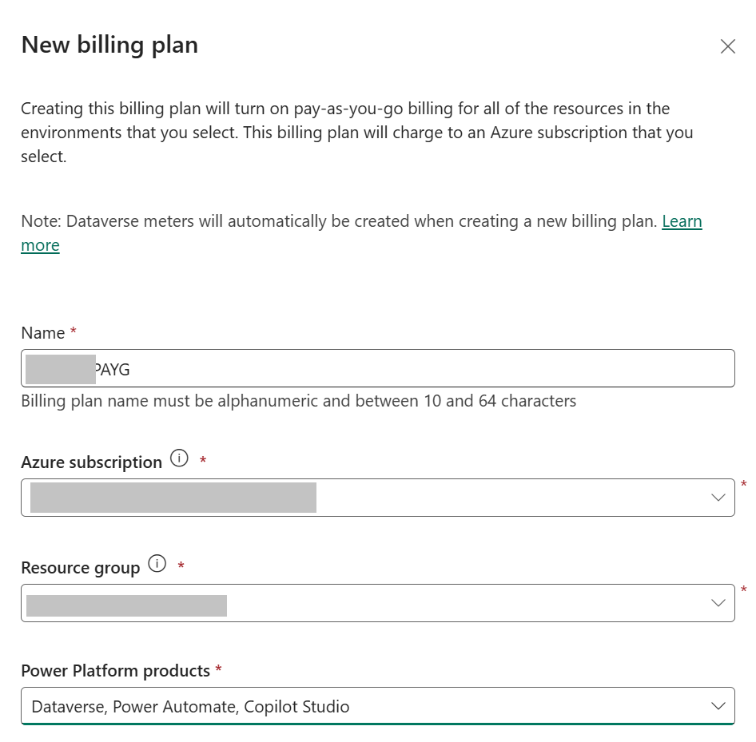

# Lab 0.1: Enable Pay-as-you-go for Copilot Studio

## Objectives

- Exercise: Enable Pay as you go for Copilot Studio in your tenant
    - Task 1: Create a billing plan (if none is available already)

## Contents

In this lab, you will configure your tenant to use Pay-as-you-go, a way to pay for Copilot Studio using an Azure subscription, which allows you to get started building agents without any license commitment or upfront purchasing. With the pay-as-you-go meter, at the end of each month, your organization pays only for the actual number of Copilot Credits its agents use during the month.

## Prerequisites

It's required to have completed **[Lab 0.0 - Create an agent](../0.0-create-an-agent/0.0-create-an-agent.md)** to follow this part.

In order to set up pay-as-you-go billing for an environment, you first need

  * An active Azure subscription that you can link to that environment. A resource group within this subscription. 

  * The user following this procedure requires `Owner` or `Contributor` role in Azure, both at the Subscription andand the resource group.

  * The user following this procedure requires **one** of the following roles in the Power Platform Admin Center: `Environment admin`, `Power Platform admin`, `Global admin`, `Dynamics 365 admin`.
 
  * Validate the most updated pre-requisites [here](https://learn.microsoft.com/en-us/power-platform/admin/pay-as-you-go-set-up).

## Estimated Completion Time

- 30 minutes

## Exercise 1: Link your environment to an Azure Subscription

In the Power Platform admin center, you can link environments to an Azure subscription using a billing policy. Create a billing policy associated with your Azure subscription in Power Platform admin center.

Linking an environment to an Azure subscription turns on billing through Azure meters. Any app usage or Dataverse and Power Platform usage that exceeds the included amounts is billed to the Azure subscription.

### Task 1: Create a billing plan (if none is available already)

1. Go to Power Platform Admin Center https://admin.powerplatform.microsoft.com/ and select your environment

2. Navigate to Licensing > Copilot Studio

3. Click **Create a billing plan** (if none is already created)

4. Provide the required fields:

    * **Name**: Provide a name. Only alphanumeric characters allowed, like `MCSPAYG`.

    * **Azure Subscription**: Select the subscription to be linked.

    * **Resource group**: Select a resource group on this subscription. The Power Platform account resource—that's associated with this billing plan—is created in this resource group. If there are no resource groups in the specified subscription, you need to create one in the Azure portal before proceeding.

    * **Power Platform products**: Select `Dataverse`, `Power Automate`, `Copilot Studio`.

4. Click **Next**

5. Choose the region where your desired environment is located, select the environment in the list, and click **Save** 

5. Your new billin plan is created.